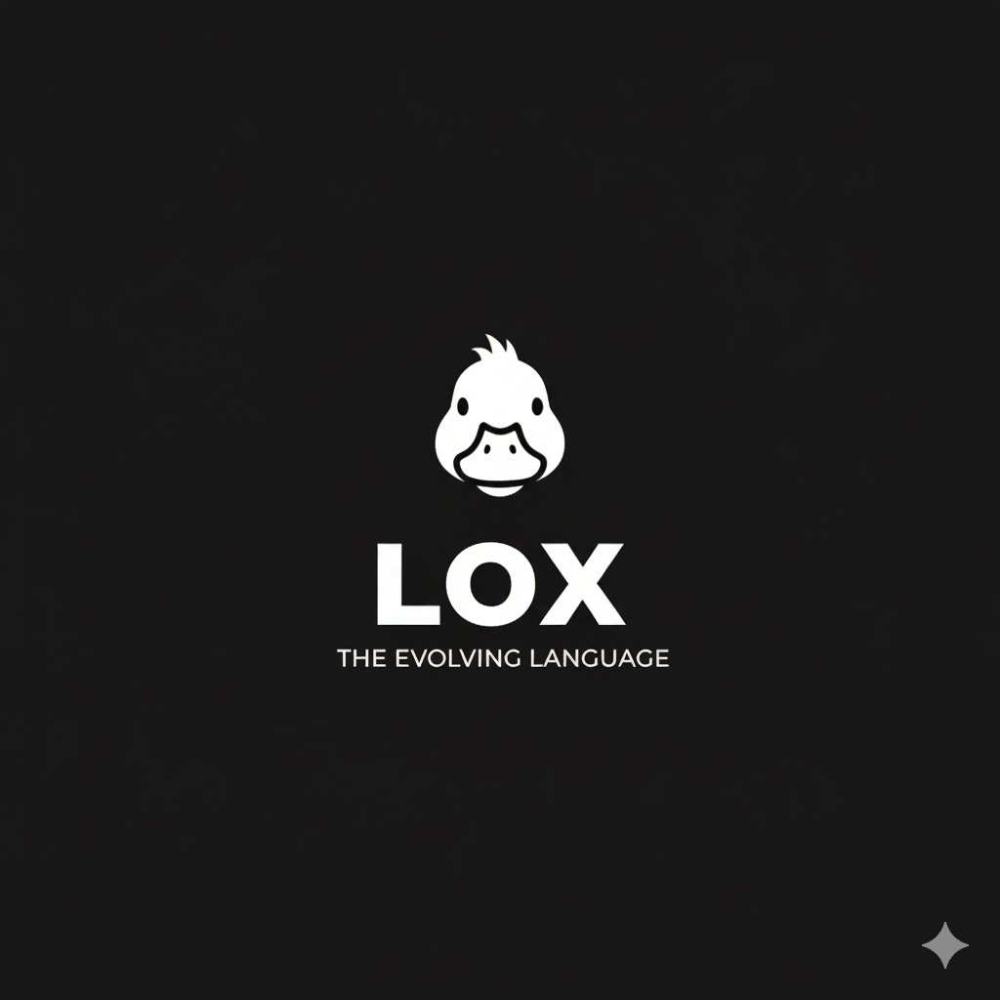

<p align="center">
  
</p>

<h1 align="center">gentleduck/diagnostic</h1>

<p align="center">
  Generic diagnostic engine for Rust. Drop it into compilers, linters, SQL engines, config validators, whatever needs nice error output.
</p>

<p align="center">
  <a href="https://crates.io/crates/duck-diagnostic"></a>
  <a href="https://docs.rs/duck-diagnostic"></a>
  <a href="./LICENSE"></a>
</p>

## What's in 0.3

- **rustc-style diff suggestions** — `with_suggestion(...)` now renders `-` original / `+` replacement with red/green coloring and aligned line gutter, matching rustc's fix-it format.

## What's in 0.2

- **Multi-file diagnostics** — labels in different files render as separate sections.
- **Suggestions / fix-its** — `with_suggestion(Suggestion::new(span, replacement))` plus `Applicability` (auto-applicable / review / placeholders).
- **`Severity::Bug`** — for ICEs; counted separately, distinct color.
- **JSON output mode** — `engine.format_all_json()` (stable schema, opt-in via default `json` feature).
- **`Span::from_zero_based(file, line, col, len)`** — drop-in for parsers that emit 0-based positions.
- **`Label::with_note(s)`** — span-local note rendered under the caret.
- **Tab + Unicode-width aware** — carets line up under emoji / CJK / tab-indented sources.
- **`SourceCache`** — split source once, reuse across many diagnostics.
- **`RenderOptions`** — tab width, context lines, max line width, color toggle.
- **`diag!` macro** — short form `diag!(MyError::Foo, span, "msg")`.
- **Long-line truncation** — `RenderOptions::max_line_width` clamps with ellipsis.
- **Error code URLs** — `DiagnosticCode::url()` rendered after the code.

## Quick start

```toml
[dependencies]
duck-diagnostic = "0.3"
```

```rust
use duck_diagnostic::*;

#[derive(Debug, Clone, Copy, PartialEq, Eq, Hash)]
enum MyError {
    SyntaxError,
    UnusedImport,
}

impl DiagnosticCode for MyError {
    fn code(&self) -> &str {
        match self {
            Self::SyntaxError  => "E0001",
            Self::UnusedImport => "W0001",
        }
    }
    fn severity(&self) -> Severity {
        match self {
            Self::SyntaxError  => Severity::Error,
            Self::UnusedImport => Severity::Warning,
        }
    }
}

fn main() {
    let source = "let x = ;";
    let mut engine = DiagnosticEngine::<MyError>::new();

    engine.emit(
        Diagnostic::new(MyError::SyntaxError, "unexpected `;`")
            .with_label(Label::primary(
                Span::new("main.lang", 1, 8, 1),
                Some("expected expression before `;`".into()),
            ))
            .with_help("try `let x = <value>;`"),
    );

    engine.print_all(source);
}
```

Output:

```
error: [E0001]: unexpected `;`
  --> main.lang:1:8
   |
 1 | let x = ;
   |         ^ expected expression before `;`
   |
   = help: try `let x = <value>;`
```

## How it works

You define an enum with your error codes and implement `DiagnosticCode` on it. That's it. The engine handles collecting, counting, and rendering.

```
DiagnosticEngine<C>       collects diagnostics, tracks counts, renders output
  Diagnostic<C>           single error/warning with labels, notes, help
    C: DiagnosticCode     your enum
    Label                 points at source code (span + message + style)
      Span                file + line + column + length
    notes: Vec<String>
    help: Option<String>
```

## DiagnosticCode trait

```rust
pub trait DiagnosticCode: fmt::Debug + Clone {
    fn code(&self) -> &str;
    fn severity(&self) -> Severity;
    fn url(&self) -> Option<&'static str> { None }   // optional doc link
}
```

`Severity` variants: `Bug` (ICE), `Error`, `Warning`, `Note`, `Help`.

## API

### Span

```rust
Span::new(file, line, column, length)
```

Just a location. Not tied to any lexer or parser.

### Label

```rust
Label::primary(span, message)    // ^^^^ main error site
Label::secondary(span, message)  // ---- related context
```

### Diagnostic

```rust
Diagnostic::new(code, message)
    .with_label(label)
    .with_note(note)
    .with_help(help)
```

Builder methods take `impl Into<String>`, so both `&str` and `String` work.

### DiagnosticEngine

```rust
let mut engine = DiagnosticEngine::<MyError>::new();

engine.emit(diagnostic);
engine.emit_errors(vec![...]);          // batch emit
engine.emit_warnings(vec![...]);
engine.extend(other_engine);           // merge two engines

engine.has_errors();
engine.has_warnings();
engine.error_count();
engine.warning_count();

engine.print_all(source_code);          // colored terminal output
engine.format_all(source_code);         // colored string (no print)
engine.format_all_plain(source_code);   // plain text for logs/CI

engine.get_diagnostics();               // &[Diagnostic<C>]
engine.get_errors();                    // Vec<&Diagnostic<C>>
engine.get_warnings();
engine.len();
engine.is_empty();
engine.clear();
```

## Examples

**Compiler** - scanner/parser/semantic errors: [`examples/compiler.rs`](examples/compiler.rs)

**SQL engine** - unknown columns, division by zero, missing indexes: [`examples/sql_engine.rs`](examples/sql_engine.rs)

**Config linter** - duplicate keys, invalid values, deprecated fields: [`examples/config_linter.rs`](examples/config_linter.rs)

**API validator** - missing fields, bad formats, deprecated endpoints: [`examples/api_validator.rs`](examples/api_validator.rs)

**Suggestion / fix-it** - auto-applicable rewrites: [`examples/suggestion.rs`](examples/suggestion.rs)

**Diff suggestions** - rustc-style `-`/`+` rendering, insertions, multi-line, applicability levels: [`examples/diff_suggestions.rs`](examples/diff_suggestions.rs)

**Multi-file** - labels across two files: [`examples/multi_file.rs`](examples/multi_file.rs)

**JSON output** - LSP/IDE-friendly: [`examples/json_output.rs`](examples/json_output.rs)

**All at once**: `cargo run --example demo`

```sh
cargo run --example compiler
cargo run --example suggestion
cargo run --example json_output
cargo run --example multi_file
```

## Advanced API

### Render options

```rust
let opts = RenderOptions {
    tab_width: 2,
    context_lines: 2,
    max_line_width: 120,
    color: false,
};
let s = engine.format_all_with(source, opts);
```

### Source cache (reuse across diagnostics)

```rust
let cache = SourceCache::new(source);
for d in engine.get_diagnostics() {
    let f = DiagnosticFormatter::with_cache(d, &cache);
    print!("{}", f.format());
}
```

### `from_zero_based`

```rust
// Parser emits 0-based line+column? No problem.
let span = Span::from_zero_based("a.rs", 0, 0, 1);
assert_eq!(span.line, 1);
assert_eq!(span.column, 1);
```

### Suggestions

```rust
Diagnostic::new(MyLint::PreferLet, "use `let`")
    .with_suggestion(
        Suggestion::new(span, "let")
            .with_message("replace with `let`")
            .with_applicability(Applicability::MachineApplicable),
    );
```

### `diag!` macro

```rust
let d = diag!(MyError::Foo, span, "msg")
    .with_help("try this");
```

### JSON

```rust
let json = engine.format_all_json();   // schema-stable, IDE-ready
```

## Contributing

See [CONTRIBUTING.md](./CONTRIBUTING.md) for guidelines.

## Security

See [SECURITY.md](./SECURITY.md) for reporting vulnerabilities.

## License

[MIT](./LICENSE) - Copyright (c) 2024 @gentleduck
